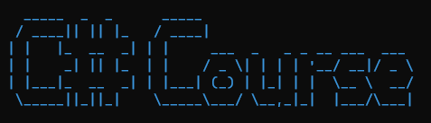
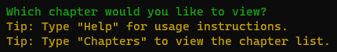
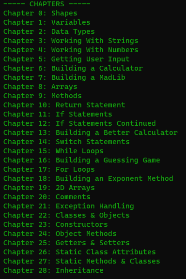

# CSharp Course

An interactive console application based off of the [C# Tutorial - Full Course for Beginners](https://youtu.be/GhQdlIFylQ8?si=P3Es8gfgfm93tF55) from [FreeCodeCamp](https://www.freecodecamp.org/).







## Credits

Programmer: [Boden McHale](https://bodenmchale.github.io/)

Course Creator: [Mike Dane](https://www.giraffeacademy.com)

Contributors: None :(

## Contributing

Thank you for considering contributing to [Your Project Name]! Contributions are **greatly appreciated** and can come in many forms. Whether it's submitting bug reports, suggesting new features, or making code contributions, every bit helps to improve the project.

Before you start contributing, please take a moment to read the following guidelines:

### How Can You Contribute?

- **Report Bugs**: If you encounter any bugs or issues while using the project, please [submit a bug report](https://github.com/BodenMcHale/CSharp-Course/issues/new?template=bug_report.md).

- **Suggest Enhancements**: Have an idea to improve the project? [Create an enhancement suggestion](https://github.com/BodenMcHale/CSharp-Course/issues/new?template=feature_request.md) outlining your proposal.

- **Submit Pull Requests**: If you're comfortable with coding, you can contribute directly by submitting pull requests.

### Getting Started

1. Fork the repository and clone it locally.
2. Create a new branch for your contribution: `git checkout -b feature/your-feature`.
3. Make your changes and test thoroughly.
4. Commit your changes: `git commit -am 'Add new feature'`.
5. Push to the branch: `git push origin feature/your-feature`.
6. Create a pull request, following the provided template.

### Feedback

Feedback is valuable! If you have any suggestions or questions about contributing, feel free to [open an issue](https://github.com/BodenMcHale/CSharp-Course/issues/new) to discuss it.

By contributing to this project, you agree to its [license](LICENSE). Your contributions will be acknowledged in the repository's list of contributors.

Thank you for helping to make this project better!

## License

```
MIT License

Copyright (c) 2023 Boden McHale

Permission is hereby granted, free of charge, to any person obtaining a copy
of this software and associated documentation files (the "Software"), to deal
in the Software without restriction, including without limitation the rights
to use, copy, modify, merge, publish, distribute, sublicense, and/or sell
copies of the Software, and to permit persons to whom the Software is
furnished to do so, subject to the following conditions:

The above copyright notice and this permission notice shall be included in all
copies or substantial portions of the Software.

THE SOFTWARE IS PROVIDED "AS IS", WITHOUT WARRANTY OF ANY KIND, EXPRESS OR
IMPLIED, INCLUDING BUT NOT LIMITED TO THE WARRANTIES OF MERCHANTABILITY,
FITNESS FOR A PARTICULAR PURPOSE AND NONINFRINGEMENT. IN NO EVENT SHALL THE
AUTHORS OR COPYRIGHT HOLDERS BE LIABLE FOR ANY CLAIM, DAMAGES OR OTHER
LIABILITY, WHETHER IN AN ACTION OF CONTRACT, TORT OR OTHERWISE, ARISING FROM,
OUT OF OR IN CONNECTION WITH THE SOFTWARE OR THE USE OR OTHER DEALINGS IN THE
SOFTWARE.
```
